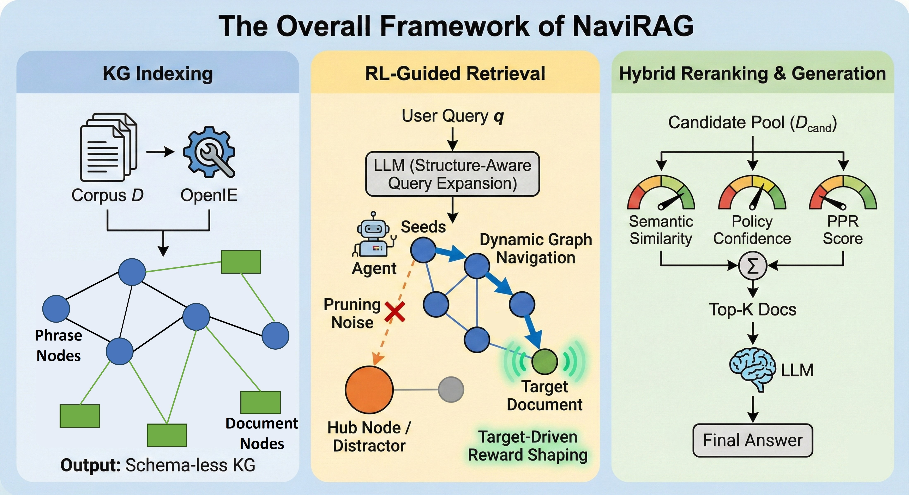

# NaviRAG: Navigation-Based Retrieval-Augmented Generation

**NaviRAG** is an advanced Retrieval-Augmented Generation (RAG) framework designed to tackle complex multi-hop reasoning tasks. By constructing a knowledge graph from your corpus and employing a Reinforcement Learning (RL) agent, NaviRAG learns to "navigate" from a query to the correct supporting documents, outperforming traditional dense retrieval methods.




### ✨ Key Features

**NaviRAG** reformulates retrieval as a dynamic graph navigation problem, offering a robust alternative to static retrieval methods.

* **🧠 Dynamic Graph Navigation via RL**
Unlike static probability diffusion (e.g., PPR) or vector similarity, NaviRAG employs a **Reinforcement Learning (RL)** agent to actively traverse the Knowledge Graph. It sequentially selects reasoning paths, allowing for explicit multi-hop reasoning chains that mimic human deduction.
* **🛡️ Robustness Against Popularity Bias**
Traditional graph retrieval often gets trapped by high-degree "super-nodes" (hubs). NaviRAG's policy network is trained to identify and prune irrelevant branches, effectively bypassing popular distractors (e.g., distinguishing between a *producer* and a *director* despite structural similarities) to locate precise long-tail knowledge.
* **bridge Structure-Aware Query Expansion**
Bridges the modality gap between unstructured natural language queries and structured graphs. NaviRAG utilizes an LLM to extract structural triples from queries, ensuring precise initialization (seed node selection) for the navigation agent.
* **⚖️ Multi-View Hybrid Reranking**
Combines the best of multiple worlds. The final retrieval score is a weighted aggregation of:
1. **Dynamic Reasoning Signal:** The agent's navigation confidence (Policy Score).
2. **Semantic Relevance:** Vector similarity between query and document.
3. **Global Structure:** Static structural importance (PPR Score).


This hybrid approach ensures high recall while maintaining reasoning precision.
* **🌐 Schema-less OpenIE Support**
Designed for flexibility, NaviRAG operates on **Schema-less Knowledge Graphs** constructed via Open Information Extraction (OpenIE). It does not require expensive, pre-defined ontologies, making it adaptable to any raw text corpus.
* **⚡ Sample-Efficient Training**
Utilizes **Target-Driven Reward Shaping** to provide dense supervision signals. The agent can be effectively trained with limited data to achieve state-of-the-art performance on complex multi-hop QA benchmarks.


## 🚀 Installation

We recommend using **Conda** to manage the environment.


1. **Create a Conda environment (Python 3.12):**
```bash
conda create -n navirag python=3.12
conda activate navirag

```


2. **Install PyTorch:**
Install the version appropriate for your CUDA setup. For example:
```bash
pip install torch torchvision torchaudio --index-url https://download.pytorch.org/whl/cu121

```


3. **Install remaining dependencies:**
```bash
pip install -r requirements.txt

```


4. **Environment Setup:**
Ensure you have your LLM API keys set up (e.g., `OPENAI_API_KEY`) or a local vLLM endpoint ready for the OpenIE and QA processes.

## 📊 Data Preparation

Place your datasets in the `datasets/` folder. The expected structure for a dataset (e.g., `2wikimultihopqa`) is:

```text
datasets/
└── 2wikimultihopqa/
    ├── 2wikimultihopqa_corpus.json  # The full corpus
    ├── test.json                    # Test queries and gold answers
    ├── train.json                   # (Generated automatically by train.py)
    └── val.json                     # (Generated automatically by train.py)

```

**Data Format:**

* **Corpus (`*_corpus.json`)**: A list of dictionaries.
```json
[{"title": "Doc Title", "text": "Content of the document..."}]

```


* **Samples (`test.json`)**:
```json
[
  {
    "question": "Who is the director...",
    "answer": ["Person Name"],
    "supporting_facts": [["Doc Title", 0]],
    "context": [["Doc Title", ["Sentence 1", "Sentence 2"]]]
  }
]

```


## 🏃 Usage

### 1. Training the RL Agent (`train.py`)

Train the navigation policy network. This script handles data splitting, index creation, and the RL training loop.

**Note:** You must specify the embedding model used for encoding nodes.

```bash
python train.py \
  --dataset 2wikimultihopqa \
  --epochs 30 \
  --val_split 0.1 \
  --llm_name "meta/llama-4-maverick-17b-128e-instruct" \
  --embedding_name "Qwen/Qwen3-Embedding-4B" \
  --save_dir outputs

```

**Key Arguments:**

* `--dataset`: Dataset name (default: `2wikimultihopqa`).
* `--embedding_name`: The embedding model used for encoding nodes (default: `Qwen/Qwen3-Embedding-4B`).
* `--epochs`: Number of training epochs (default: `30`).
* `--val_split`: Fraction of data to use for validation (default: `0.1`).
* `--force_index_from_scratch`: Set to `true` to force rebuilding the graph index.

### 2. Running Evaluation (`main.py`)

Evaluate the trained NaviRAG model on the test set.

```bash
python main.py \
  --dataset 2wikimultihopqa \
  --llm_name "meta/llama-4-maverick-17b-128e-instruct" \
  --embedding_name "Qwen/Qwen3-Embedding-4B" \
  --save_dir outputs

```

**Key Arguments:**

* `--dataset`: Dataset to evaluate (default: `2wikimultihopqa`).
* `--embedding_name`: **Must match** the embedding model used during training.
* `--save_dir`: Directory where the trained model (`best_policy.pth`) is stored (default: `outputs`).

## 🤝 Acknowledgements

We learn the Knowledge Graph construction methods from [OSU-NLP-Group/HippoRAG](https://github.com/OSU-NLP-Group/HippoRAG). 


## 🤝 Contribution

Contributions are welcome! Please open an issue or submit a pull request for improvements.

---

## 📂 Project Structure

```text
NaviRAG/
├── navirag/                 # Core library package
│   ├── NaviRAG.py           # Main class integrating Graph and RL logic
│   ├── StandardRAG.py       # Baseline Dense Passage Retrieval implementation
│   ├── embedding_store.py   # Vector storage management
│   ├── llm/                 # LLM interface wrappers
│   └── ...
├── scripts/                 # Execution scripts
│   ├── main.py              # Evaluation script for NaviRAG
│   ├── train.py             # Training script for the RL Agent
│   ├── main_dpr.py          # Standard RAG baseline script
│   └── ...
├── datasets/                # Data storage
│   └── <dataset_name>/      # e.g., 2wikimultihopqa/
│       ├── <name>_corpus.json
│       ├── test.json
│       ├── train.json       # Generated by train.py
│       └── val.json         # Generated by train.py
├── outputs/                 # Directory for logs, indices, and saved RL models
├── requirements.txt         # Project dependencies
└── README.md

```